# ProfSidekick API — System Design Document

**Scope:** Backend repo only (`profsidekick-api`, `D:\code\mmedcon\profsidekick\backend-main`, branch `staging`, indexed by GitNexus: 275 files / 5,867 nodes / 13,691 edges / 300 execution flows).
**Method:** Read-only investigation via the GitNexus code graph (`route_map`, `context`, `query`, `cypher`) plus direct source reads, cross-checked against Alembic migration history. No code was modified.
**Frontend repo** (`profsidekick-frontend`) was intentionally **not** read; anywhere a flow crosses into it, it is marked `[CROSS-REPO — see frontend SDD, not investigated in this pass]`.

---

## 1. Executive Summary

ProfSidekick is a FastAPI backend for an LMS-plus-AI-tutoring platform with three actor types — **publishers** (build courses and configure an AI "persona" bound to a 3D avatar), **subscribers** (consume content and run live AI-avatar sessions), and **admins**. The backend owns auth, course/avatar/persona data, session lifecycle, a homegrown credit-based billing ledger, a Wix payment webhook, and two independent AI subsystems (a client-facing OpenAI Realtime pipeline for avatar sessions, and a server-side Vertex/Gemini/OpenAI fallback chain for autograding). The codebase shows clear signs of rapid, wave-by-wave feature growth (comments tagged `W1A`…`W7`, `R##` requirement IDs) layered on an older "v1" design that was partially abandoned in place — dormant stub models, an unmounted router, and several publisher-facing gates that were explicitly disabled and never re-enabled are all still present and graph-traceable. Functionally the app works (87 Alembic migrations, a real credit-ledger data model, a real webhook), but three findings in this pass are severe enough to call out up front: an admin-only-in-appearance credit-top-up endpoint has no payment verification at all (§6), the Wix webhook idempotency guard references a model attribute that does not exist and will raise on every invocation (§6), and every usage-based billing figure in the system (realtime session tokens, TTS character counts) is self-reported by the client rather than measured by the backend or the AI provider (§4, §5). The biggest architectural risk for the business's stated pricing goal is that last point: there is no backend-verified cost signal to build cost-plus pricing on top of today.

---

## 2. Actors & Core Domain Model

All models below are SQLAlchemy ORM classes under `app/database/models/`. Field lists are trimmed to what matters for this document; see the cited files for full column lists.

### 2.1 User (`app/database/models/users.py`)
`User` (table `users`) is the single actor table — `role` is a free-text column (`"subscriber"` default, or `"publisher"`/`"admin"`), not a separate table or enum, and is checked as a raw string throughout the API layer (e.g. `app/dependencies/auth.py:76-105`). There is no `Publisher` or `Subscriber` class — the conceptual actors are *roles on one User row*, not distinct entities. `User` also carries GDPR/consent timestamps, a `current_program_id` FK to `Program`, and cascades to `sessions`, `session_runs`, `avatars_published`, `agreements`.

### 2.2 AI Persona / Avatar — two parallel systems (divergence from the brief)
The brief's "Publisher configures an AI persona bound to a 3D avatar" maps to **two distinct, non-interchangeable model families** in this codebase:

- **Live system** (mounted, used by `context_builder.py`):
  - `AvatarTemplate` / `AvatarTemplateVersion` / `AvatarTemplateRole` (`app/database/models/templates.py`) — admin-managed prompt templates with immutable versioned snapshots (`conversation_prompt`, `teaching_prompt`, `examination_prompt`, `document_analysis_prompt`).
  - `Avatar` (`app/database/models/avatars.py:11-46`) — a publisher's instantiation of a template, with `subscription_cost`, a link to `template_version_id` (frozen at creation — new template versions do **not** retroactively change published avatars), and relations to `configuration`, `profile`, `variants`, `avatar_courses`, `access_codes`.
  - `AvatarConfiguration` (`avatars.py:72-96`) — behavioral settings (voice, language, difficulty, `tts_provider`) plus child `Rubric`/`KnowledgeDocument`/`ReferenceSolution` rows.
  - `PublisherAvatarProfile` (`avatars.py:49-69`) — structured teaching-preference sliders (`teaching_pace`, `questioning_style`, `formality_level`, `depth_level`, `encouragement_level`, `language_level`) plus an LLM-generated `refined_prompt`. This is the actual "persona" text that reaches the student — confirmed by `app/services/context_builder.py:183-213`, which splices `PublisherAvatarProfile.refined_prompt` into the realtime system prompt as a `[TEACHING PERSONA]` block alongside the template's mode-resolved prompt.
  - `Avatar3DModel` / `AvatarVariant` (`app/database/models/variants.py`) — the actual 3D-model binding: `AvatarVariant` links an `Avatar` to an `Avatar3DModel` (`file_path`, `model_type`, default `three_js`) plus a HeyGen avatar/voice ID and language, with one variant flagged `is_default`.
- **Dead system** (defined, never mounted — see §6): `ProfessorPersona` (`app/database/models/legacy.py:18-30`), served by `app/api/professor/api.py`, backed by a hardcoded `AVATARS` list in `app/constants/avatars.py`. The model file's own docstring calls this a "stub for dormant v1 services."
- **Half-built system** (server side complete, client side missing — see §6): `AvatarConfiguration.tts_provider` plus `app/services/voice_resolution_service.py:resolve_session_voice` (lines 46-96) implement a genuine dual voice-provider design — OpenAI native Realtime audio vs. ElevenLabs synthesis — including a subscriber-level override table (`SubscriberVoicePreference`) and provider-aware billing (`PricingConfig` rates for both `tts_openai` and `tts_elevenlabs`). The ephemeral-token endpoint (`app/api/sessions/api.py:1500-1526`) carries an explicit comment stating the intended split: OpenAI Realtime plays audio natively only when `provider=="openai"`; otherwise "the frontend runs Realtime in text-only mode and synthesises separately." **`[CROSS-REPO — see frontend SDD §4.1a]`: the frontend never implements that text-only/separate-synthesis branch, and its publisher-facing voice picker offers only the 8 OpenAI voice names — so this server-side design is currently unreachable in practice.**

### 2.3 Session (`app/database/models/sessions.py`)
- `Session` (table `sessions`) — a course-scoped teaching unit: slides (`slides_details` JSONB), an optional `avatar_id`, `session_mode` (teaching/examination/consultation), `subscriber_runtime_mode` (avatar vs. chat vs. subscriber choice), `is_published`.
- `SessionRun` (table `session_runs`) — one realtime "attempt" at a `Session`: `status` (`ACTIVE`/`COMPLETED`/`FAILED`), `start_time`/`end_time` (duration is *derived*, not stored — see §4.2), `avatar_variant_id` + `variant_snapshot` (frozen copy of the variant at run start), `ai_provider`.
- `SessionMaterial` — join table linking `CourseMaterial` rows into a `Session`.

Neither `Session` nor `SessionRun` has a token-count, cost, or usage column. All cost data lives in a completely separate billing model family (§2.4), joined only via the nullable `UsageRecord.session_run_id` FK.

### 2.4 Billing / Credit Ledger (`app/database/models/billing.py`)
- `CreditBalance` — one row per user, `balance_credits` (Numeric).
- `AccessCode` / `AccessCodeRedemption` — admin-issued, platform-wide credit codes.
- `AvatarAccessCode` / `AvatarAccessCodeRedemption` (`app/database/models/avatar_access_codes.py`) — a **second, avatar-scoped** code system (publisher-issued, redemption auto-enrolls the subscriber into linked courses/programs and optionally grants credits).
- `UsageRecord` — the actual usage-metering row: `operation_type`, `input_tokens`/`output_tokens`, `raw_cost_usd`, `platform_fee_usd`, `total_cost_usd`, `credits_charged`, `funded_by`, optional `access_code_id` and `session_run_id`, an `idempotency_key`.
- `PricingConfig` — one row per `operation_type` (e.g. `session_run`, `tts_openai`, `tts_elevenlabs`) with `cost_per_1k_input_tokens`, `cost_per_1k_output_tokens`, `platform_fee_multiplier`, `minimum_charge_credits`.
- `ProcessedWixOrder` — idempotency guard for the Wix webhook (see §6 for a schema/code mismatch on this table).
- `AutoTopUpSettings` — per-user auto-top-up threshold/amount (defined; consumer not located in this pass — see §7).

This is a genuine cost-input mechanism (`PricingConfig` × `UsageRecord` = a real per-operation, per-user cost ledger with an explicit platform-fee multiplier) — **this contradicts an assumption that no usage/cost metering exists**. What it does *not* have is independently-measured input: see §4.2 and §5.

### 2.5 Course / Program (`courses.py`, `programs.py`)
`Course` → `CourseMaterial`, `CourseStudent` (enrollment join), `CourseAccessCode` (a *third* code system, course-scoped, `app/services/course_enrollment_service.py`). `Program` (`W2B`) bundles avatars + courses; `ProgramMembership` is the enrollment join; `AvatarSubscription` (`app/database/models/assistant.py:97-114`) is the subscriber↔avatar subscription join consulted by entitlement checks (where those checks are actually enforced — see §4.2).

---

## 3. High-Level Architecture

**Backend stack** (from `requirements.txt`): FastAPI 0.104 + Uvicorn, SQLAlchemy 2.0 + Alembic (87 migrations) on PostgreSQL (`psycopg2`), Redis (session cache + Celery broker), Celery 5.3 for async post-session work, Pydantic v2 schemas.

**Third-party integrations found in code:**
- **OpenAI** — Realtime API (client-side WebRTC session; backend only mints a short-lived ephemeral token, `app/api/sessions/api.py:1346-1566` → `app/services/openai_service.py:59-199`), Chat Completions (`gpt-4o-mini` for persona refinement and vision/slide analysis), TTS voice catalog.
- **Google Vertex AI / Gemini** (`app/llm/vertex_provider.py`, `gemini_provider.py`) and **OpenAI** — a *separate* fallback chain (`app/llm/fallback_provider.py:212-304`) used only by the Math Autograder / SAE grading flows, ordered Vertex → Gemini Pro → OpenAI → Gemini Flash → Gemini Free.
- **ElevenLabs** — TTS voice catalog/reachability checks (`app/services/voice_catalog_service.py`); actual synthesis happens client-side per a code comment in `app/config.py:81-84` (`[CROSS-REPO]`).
- **Wix** — payment webhook only (`app/api/webhooks/wix.py`); no outbound Wix API calls found.
- **Brightspace (D2L Valence)** — OAuth + content import (`app/api/brightspace/api.py`).
- **AWS S3 / Cloudflare R2** — file storage (`cloud_storage_service.py`, `r2_service.py`).
- **HeyGen** — referenced only as ID fields on `AvatarTemplateRole`/`AvatarVariant` (`heygen_avatar_id`, `heygen_voice_id`); no HeyGen API client found in this repo — actual HeyGen calls, if any, are `[CROSS-REPO — likely frontend, not investigated in this pass]`.

### Component diagram (as built, not idealized)

```mermaid
flowchart TB
    subgraph frontend["Frontend — profsidekick-frontend (cross-repo, not investigated)"]
        FE["Next.js app"]
    end

    subgraph backend["profsidekick-api (FastAPI, app/main.py)"]
        AUTH["auth/api.py\ndependencies/auth.py (JWT)"]
        AVATARS["avatars/api.py + avatar_templates/api.py\navatar_service.py, persona flow"]
        SESSIONS["sessions/api.py\nsession_service.py, session_lifecycle_service.py"]
        VOICE["voice/api.py\nvoice_resolution_service.py"]
        BILLING["billing/api.py, admin/billing_api.py\nbilling_service.py"]
        SUBS["subscriptions/api.py, avatar_access_codes/api.py\nsubscription_service.py, enrollment_service.py"]
        WIX_HOOK["webhooks/wix.py"]
        AUTOGRADER["autograder/api.py, sae/*.py\nassessment_service.py"]
        PROF_DEAD["professor/api.py\n(defined, NOT mounted in main.py)"]
    end

    DB[("PostgreSQL\nusers, avatars, sessions,\nbilling ledger, courses")]
    REDIS[("Redis\nsession cache + Celery broker")]
    CELERY["Celery workers (app/worker.py)\nsummary, progress, quiz generation"]

    OPENAI_RT["OpenAI Realtime API\n(client \u2194 OpenAI direct, WebRTC)"]
    OPENAI_CHAT["OpenAI Chat Completions\n(persona refine, vision)"]
    VERTEX["Vertex AI / Gemini\n(autograder fallback chain)"]
    ELEVEN["ElevenLabs\n(voice catalog / reachability)"]
    WIX["Wix (external commerce platform)"]
    BRIGHTSPACE["Brightspace / D2L LMS"]
    STORAGE["S3 / Cloudflare R2"]

    FE -->|"REST + JWT"| AUTH
    FE -->|"REST"| AVATARS
    FE -->|"REST"| SESSIONS
    FE -->|"REST"| VOICE
    FE -->|"REST"| BILLING
    FE -->|"REST"| SUBS
    FE <-->|"WebRTC (ephemeral token minted by SESSIONS)"| OPENAI_RT

    AUTH --> DB
    AVATARS --> DB
    SESSIONS --> DB
    SESSIONS --> REDIS
    SESSIONS -->|"mint ephemeral token"| OPENAI_RT
    SESSIONS -->|"post-stop"| CELERY
    VOICE --> DB
    VOICE --> BILLING
    BILLING --> DB
    SUBS --> DB
    SUBS --> BILLING
    AVATARS -->|"persona refine"| OPENAI_CHAT
    AUTOGRADER --> VERTEX
    AUTOGRADER --> STORAGE
    VOICE -.->|"catalog/health check only"| ELEVEN
    WIX -->|"POST /api/webhooks/wix-payment"| WIX_HOOK
    WIX_HOOK --> BILLING
    CELERY --> DB
    PROF_DEAD -.->|"unreachable — no route table entry"| DB

    classDef dead fill:#666,stroke:#333,color:#fff,stroke-dasharray: 5 5
    class PROF_DEAD dead
```

---

## 4. Key Flows

### 4.1 Persona / Avatar Customization Flow (backend side)

1. **Create avatar**: `POST /api/publisher/avatars` → `create_avatar` (`app/api/avatars/api.py:87-108`, `require_publisher`) → `avatar_service.create_avatar`, validates `template_id` references an active `AvatarTemplate`, freezes `template_version_id` to the template's current version at creation time.
2. **Bind a 3D model / variant**: `POST /api/publisher/avatars/{avatar_id}/variants` (`app/api/avatars/variants.py`) creates an `AvatarVariant` row pointing at an `Avatar3DModel` (admin-managed catalog, `app/api/admin/models_api.py`), with `is_default` flag and optional HeyGen IDs.
3. **Configure behavior**: `POST/PUT /api/publisher/avatars/{avatar_id}/configuration` (`avatars/api.py:241-311`) creates/updates `AvatarConfiguration` (voice, language, difficulty, `tts_provider`) plus child rubrics/knowledge-documents/reference-solutions.
4. **Refine persona**: `POST /api/publisher/avatars/{avatar_id}/profile/refine` (`avatars/api.py:533-640`) validates teaching-preference enum values against `app/schemas/schemas.py` allow-lists, builds a draft prompt (`generate_teaching_persona_prompt`), calls OpenAI `gpt-4o-mini` via `openai_service.refine_persona_prompt`, and upserts `PublisherAvatarProfile.refined_prompt`.
5. **Publish**: `PATCH /api/publisher/avatars/{avatar_id}/publish` (`avatars/api.py:190-210`) requires an `AvatarConfiguration` to already exist.
6. **Runtime consumption**: `app/services/context_builder.py:171-213` assembles the realtime system prompt from `AvatarTemplateVersion` (mode-resolved: `teaching_prompt`/`examination_prompt`/`conversation_prompt`) plus `PublisherAvatarProfile.refined_prompt` as a `[TEACHING PERSONA]` block.

A **second, dead** persona path exists at `app/api/professor/api.py` (`GET/POST /api/professor/persona`, `/api/professor/persona/refine`) writing to `ProfessorPersona` — this router is never imported or `include_router`'d in `app/main.py` (confirmed: zero matches for `professor` in `app/main.py`), so it is unreachable in the deployed app despite being fully implemented and present in the GitNexus static route table. See §6.

### 4.2 Subscriber Session Flow (backend side) — what's tracked, what's not

1. **Eligibility pre-check** (informational only): `GET /api/sessions/{session_id}/eligibility` (`sessions/api.py:368-422`). Its own docstring/comment states: *"Subscriber gates (course opt-in, enrollment, published-only, avatar subscription) are temporarily disabled — every subscriber is eligible on those fronts. The credit-floor check below is re-enabled..."* — it estimates a 5-minute session's TTS cost via `billing_service.calculate_cost` and checks balance, but this is advisory; nothing blocks the subsequent start call.
2. **Create session**: `POST /api/sessions/create` (`sessions/api.py:117-144`) — comment at line 143-144: *"Subscriber session-creation gates (enrollment / allow_subscriber_sessions) are temporarily disabled — subscribers can freely create their own sessions."*
3. **Start run**: `POST /api/sessions/{session_id}/run/start` (`sessions/api.py:705-833`) — comment at lines 747-749: *"Subscriber gates (enrollment, allow_subscriber_sessions, published-only, avatar subscription, credit balance) are temporarily disabled — subscribers can freely create and run their own realtime sessions."* The only check retained is that the `Session` row exists.
4. **Mint ephemeral token**: `GET /api/session/ephemeral` (`sessions/api.py:1346-1566`) → `openai_service.generate_ephemeral_token` — hands the browser a short-lived OpenAI Realtime `client_secret`. **From this point the AI conversation runs client ↔ OpenAI directly over WebRTC; the backend is not in the data path and does not observe token usage.**
5. **Per-utterance TTS billing** (measured, but input is client-supplied): `POST /api/sessions/{session_id}/runs/{session_run_id}/voice-usage` (`app/api/voice/api.py:234-273`) — `character_count` is a client-reported integer (`VoiceUsageRequest.character_count`, `app/schemas/schemas.py:2527-2530`, bounded 1–50,000 but not verified against actual synthesized audio), charged via `billing_service.charge_usage` with a caller-supplied `idempotency_key` to guard against duplicate POSTs.
6. **Stop run / realtime billing**: `POST /api/sessions/{session_id}/run/{session_run_id}/stop` (`sessions/api.py:910-980`) accepts optional `input_tokens`/`output_tokens` **in the request body, self-reported by the client** — its own docstring says so explicitly (lines 921-925). These are passed to `session_lifecycle_service.run_post_session_tasks` (`app/services/session_lifecycle_service.py:27-99`), which calls `billing_service.charge_usage(operation_type="session_run", ...)` synchronously; billing failure is logged and swallowed, not fatal to the stop call. Duration (`time_spent_sec`) is derived from `session_run.start_time`/`end_time`, not stored as a column.
7. **Post-session async work**: dispatched via Celery (`run_post_session_summary`, `run_update_course_progress`, `run_generate_quiz`), falling back to a bare `asyncio.create_task` for the summary only if the Celery broker is unreachable.

**Confirmed gap** (searched `billing_service.py`, `session_lifecycle_service.py`, `openai_service.py`, `voice/api.py`, `sessions/api.py` for token counters, cost logs, usage tables, `billing_events`): a real cost-ledger table (`UsageRecord` + `PricingConfig`) exists and is wired into two billing call sites, but **every number fed into it — realtime input/output tokens and TTS character counts — is supplied by the client, not measured by the backend or reconciled against the AI provider's own usage/billing data.** There is no OpenAI usage webhook, no server-side token count from the Realtime API, and no post-hoc reconciliation job found.

### 4.3 Payment / Billing Flow (Wix)

1. Wix Automation fires `POST /api/webhooks/wix-payment` on order-paid (`app/api/webhooks/wix.py:146-272`) with a shared secret via `X-Webhook-Secret` header or `?secret=` query param (`_verify_secret`, lines 47-65) — **if `WIX_WEBHOOK_SECRET` is unset, the endpoint logs a warning and accepts unauthenticated requests** (`app/config.py:112`, default `""`).
2. Order ID, buyer email, and line items are extracted via best-effort dot-path lookups across several possible Wix payload shapes (`_extract_order_id`, `_extract_buyer_email`, `_extract_line_items`).
3. Idempotency check against `ProcessedWixOrder` — **this query and the later insert are broken; see §6, Critical finding.**
4. Buyer is matched to a `User` by email (`User.email == buyer_email.lower().strip()`); no match → no credit, order recorded with `user_id=None`.
5. Each line item's `catalogItemId`/`productId` is mapped to a fixed credit amount via `WIX_PRODUCT_CREDIT_MAP` (a JSON env var, `app/config.py:113-115`) — **this is the entire "package" model**: fixed products → fixed credit blocks, no metering, no tiers, no proration.
6. `billing_service.add_credits` credits the user's `CreditBalance`.

Entitlement enforcement server-side, where it still exists: `POST /api/subscriber/avatars/{avatar_id}/subscribe` (`app/api/subscriptions/api.py:45-127`) checks `avatar.is_published` and deducts `avatar.subscription_cost` atomically with `with_for_update()` row locking before creating the `AvatarSubscription`. This path is intact and enforced. What is *not* enforced, per §4.2, is whether an active `AvatarSubscription` (or course enrollment, or `Course.allow_subscriber_sessions`) is actually required to start a session — those checks exist in code comments as disabled, not as live gates.

---

## 5. Payments & Billing — Current State vs. Target

### Current state (as implemented, not as intended)
- **Model**: fixed packages only. A Wix "product" (SKU) maps 1:1 to a fixed credit block via `WIX_PRODUCT_CREDIT_MAP` (env-var JSON, `app/config.py:113-115`). There is no quantity-proportional or metered Wix line item handling — `quantity` on a line item just multiplies the fixed credit amount (`app/api/webhooks/wix.py:230-231`).
- **Separately**, the platform has its own internal *usage-based ledger* one layer up from Wix: `PricingConfig` (cost-plus formula: `raw_cost = tokens/1000 × rate; total = raw_cost × platform_fee_multiplier; credits_charged = max(total × credits_per_usd, minimum_charge_credits)`, `app/services/billing_service.py:86-130`) charges credits per `session_run` and per `tts_openai`/`tts_elevenlabs` operation, seeded with illustrative rates in migrations `o6j7k8l9m0n1` (session_run: $0.0015/$0.006 per 1k tokens in/out, 1.2× fee) and `v9tts0004` (TTS: $0.015–$0.18 per 1k chars, 1.2× fee). **This is a real, working cost-plus mechanism already in the codebase** — admins can tune it live via `PATCH /api/admin/billing/pricing/{operation_type}` (`app/api/admin/billing_api.py:93-108`) without a deploy.
- **The gap is the input, not the formula**: as documented in §4.2, the token/character counts feeding this formula are self-reported by the client. A cost-plus price built on this data today would be built on numbers the platform cannot independently verify.
- **Three parallel code/access-code systems** exist with overlapping purpose: platform-wide `AccessCode` (billing.py), avatar-scoped `AvatarAccessCode` (avatar_access_codes.py), and course-scoped `CourseAccessCode` (courses.py, via `course_enrollment_service.py`). None appear to be dead (all have live, mounted routes), but this is duplicated business logic worth consolidating before building a tiered pricing UI on top of it.
- **Credit-purchase bypass**: `POST /api/billing/add-credits` (`app/api/billing/api.py:77-94`) lets any authenticated user mint their own credits with no payment verification — see §6, Critical. This must be closed before any pricing model (fixed or metered) can be trusted.

### Inventory of usable cost inputs today
- Per-operation-type admin-tunable pricing (`PricingConfig`) — usable as a rate table for a cost-plus model once input data is trustworthy.
- Per-charge audit trail (`UsageRecord`) — has `raw_cost_usd`, `platform_fee_usd`, `total_cost_usd`, `funded_by`, `ai_provider` — enough shape to report on if the underlying counts were accurate.
- **No infrastructure/server cost accounting found anywhere** (searched `services/`, `database/models/`, `constants/` for hosting/compute cost tables or constants) — the "(b) server/infrastructure subscription costs" input the business wants for its 40%-margin target has no representation in this codebase at all; that number would have to come from hosting-provider billing (Railway/Fly.io per `fly.toml`/`railway.json`/`Procfile` at repo root), not from application code.

### Target model (context only — no gaps implemented)
The business wants usage-based billing (if Wix supports it) or a finer-grained package/tier system, priced at real cost + 40% margin. Gaps blocking that, purely from this repo's evidence:
1. No server-verified usage signal for the dominant cost driver (realtime AI session tokens) — see §4.2.
2. No infrastructure/server cost input exists in-repo to combine with AI cost for a true blended cost-plus number.
3. Whether Wix's platform/API supports metered or usage-based billing at all is **[UNVERIFIED — Wix product/API capability, not determinable from this repository; requires research outside this pass, no web access available]**. What's certain from the code is that only fixed-package webhook handling is implemented today (§4.3).

---

## 6. Technical Debt & Findings Catalog

| Location | Issue | Evidence (refs) | Severity | Notes |
|---|---|---|---|---|
| `app/api/billing/api.py:77-94` (`add_credits`), `app/schemas/schemas.py:1735-1736` (`AddCreditsRequest`) | `POST /api/billing/add-credits` lets **any authenticated user of any role** self-credit an arbitrary `amount_usd` with zero payment verification — no receipt, token, or admin gate; only `Depends(get_current_user)`. | Route mounted via `app/main.py:227` (`billing_router`); calls `billing_service.add_credits` (`billing_service.py:317-341`) directly. `AddCreditsRequest` has exactly one field, `amount_usd: Decimal = Field(..., gt=0)` — no payment reference of any kind. | **Critical** | Confirmed by direct read of route, schema, and service; not graph-inferred. This is a real free-credit-minting bug, not a design choice — no code path ties it to Wix or any payment confirmation. |
| `app/api/webhooks/wix.py:182-183, 281-287` vs. `app/database/models/billing.py:98-108` | Wix webhook idempotency check/insert references `ProcessedWixOrder.wix_order_id`, but the ORM model only defines `order_id` (no `wix_order_id` attribute exists on the class). | `db.query(ProcessedWixOrder).filter(ProcessedWixOrder.wix_order_id == ...)` and `ProcessedWixOrder(wix_order_id=...)` in `wix.py`; model class body in `billing.py` shows only `order_id = Column(...)`. Migration `alembic/versions/c2222222222c_add_processed_wix_orders_table.py:44` created the column as `wix_order_id` (matching the webhook code, not the model) and never added `raw_payload` (which the model declares). GitNexus `context()` on `ProcessedWixOrder` shows zero outgoing field-level references, consistent with the model and its real usage having diverged. | **Critical** | This will raise `AttributeError`/`TypeError` on essentially every webhook delivery, meaning the idempotency guard — and by extension the whole webhook — likely does not function as written on the current model definition. Needs runtime verification against the actual deployed DB schema (which of `order_id`/`wix_order_id` really exists in production is not resolvable from source alone) but the model and the only caller of it are mutually inconsistent regardless. |
| `app/api/sessions/api.py:143-144, 384-388, 747-749` | Subscriber-side entitlement gates (course enrollment, `Course.allow_subscriber_sessions`, published-only, avatar subscription, and — at run-start — even the credit-balance check) are explicitly disabled by comment at three separate call sites: session create, eligibility pre-check, and run start. Only "does the Session row exist" remains enforced for subscribers. | Direct quotes cited in §4.2. | **High** (security/business-logic) | Not proven "dead" in the Nexus sense (the code paths are live and reachable) — this is a *disabled feature*, not unused code. Flagged per instructions as a security-relevant finding: subscribers can currently run any session regardless of enrollment, publication status, or subscription. |
| `app/api/professor/api.py` (whole file), `app/database/models/legacy.py:18-30` (`ProfessorPersona`), `app/constants/avatars.py` (`AVATARS` list) | Entire router (`GET/POST /api/professor/persona`, `/refine`, `/api/avatars` professor-scoped list) is implemented but never mounted — `app/main.py` has zero references to `professor` (`grep -n professor app/main.py` → no matches; confirmed also via absence of any `from app.api.professor import` anywhere in `app/`). | `legacy.py` docstring: *"Stub models for dormant v1 services that import from app.database.models but whose routers are not registered in main.py."* GitNexus `route_map` still lists these routes (static AST detection), which is why they must be cross-checked against `main.py`'s `include_router` calls rather than trusted at face value. | **Medium** (dead code, confirmed via graph + entrypoint check) | Genuinely dead — zero live HTTP reachability. Safe to remove, but do so deliberately since `persona_service.py` and the `ProfessorPersona`/`AVATARS` constants are only consumed here. |
| `app/main.py:107-125` (FastAPI `description=` string) | App-level OpenAPI description states *"Currently, this API does not require authentication."* This is false — `app/dependencies/auth.py` implements full JWT bearer auth (`HTTPBearer`) used by nearly every router. | Direct read of `main.py` vs. `auth.py`. | **Low** (stale documentation, publicly visible at `/docs`) | Cosmetic but visible externally via Swagger UI; worth a one-line fix. |
| `app/services/billing_service.py` (`charge_usage`) + `app/api/voice/api.py:259-267`, `app/api/sessions/api.py:929-930` | All usage inputs to the cost-plus billing formula (`input_tokens`, `output_tokens`, `character_count`) are supplied by the calling client, not measured server-side or reconciled against the AI provider. | §4.2 citations; `VoiceUsageRequest.character_count` schema (`schemas.py:2527-2530`); `stop_session_run` docstring (`sessions/api.py:921-925`). | **High** (billing integrity / pricing-readiness) | Not a bug per se — architecturally forced by the realtime session running client↔OpenAI directly over WebRTC (§4.2 step 4) — but it means the ledger cannot currently be trusted as a cost source of truth. Central blocker for §5's target model. |
| Three parallel access-code systems: `AccessCode`/`AccessCodeRedemption` (`billing.py`), `AvatarAccessCode`/`AvatarAccessCodeRedemption` (`avatar_access_codes.py`), `CourseAccessCode` (`courses.py`) | Overlapping "redeem a code for entitlement/credits" business logic implemented three separate times with three separate services (`billing_service`, `avatar_access_code_service`, `course_enrollment_service`). | Route map: `/api/billing/redeem`, `/api/avatar-access-codes/redeem`, `/api/courses/{course_id}/access-codes`; all three have live, mounted routers. | **Medium** (duplication, not dead) | All three are reachable and appear used (not a dead-code finding), but the redundant modeling raises the cost of any future pricing/entitlement redesign. Consolidation candidate. |
| `app/database/models/billing.py:112-124` (`AutoTopUpSettings`) | Model exists (`is_enabled`, `threshold_credits`, `top_up_amount_credits`) but no service or route that reads/writes it was located in this pass (searched `billing_service.py`, `app/api/billing/`, `app/api/admin/billing_api.py`). | Grep across `app/services/`, `app/api/` for `AutoTopUpSettings` found only the model file and its import in `app/database/models/__init__.py`. | **Low–Medium** (possibly dead, not fully confirmed) | GitNexus `context()` was not run on this specific symbol during this pass — reference count should be re-verified before removing; flagged here as likely-unused rather than confirmed-unused per the "don't guess dead code" rule. |
| Frontend pricing/entitlement duplication risk | `Avatar.subscription_cost`, `AccessCode`/credit amounts, and the eligibility pre-check's cost estimate (`sessions/api.py:395-420`) are all values a frontend UI would plausibly need to mirror for display (e.g. "this will cost N credits") before the backend call — if the frontend independently computes or hardcodes any of this rather than reading it from these endpoints, that's duplicated business logic. | Backend-side evidence only; frontend not investigated. | **Flag — possible frontend duplication, verify against frontend SDD** | Cannot be confirmed or denied from this repo alone per scope boundary. |
| `app/services/voice_resolution_service.py:46-96`, `app/api/sessions/api.py:1500-1526,1682-1689` | Dual voice-provider design (OpenAI native vs. ElevenLabs) is fully implemented and billed server-side, but its only consumer — the frontend's live session runtime — never reads the `voice_provider` field or implements the "text-only + separate synthesis" mode the code explicitly expects. | `[CROSS-REPO — confirmed in frontend SDD §4.1a/§6]`: frontend voice picker offers only 8 OpenAI voice names; zero references to `voice_provider`/`text-only`/`modalities`-branching in live session components; `modalities: ["text","audio"]` is hardcoded unconditionally. | **High** | Not a backend bug per se — the backend half is correct and complete — but this endpoint's design intent is currently unreachable, and any avatar resolved to `provider="elevenlabs"` silently produces the wrong voice for the learner with no error surfaced anywhere. |

---

## 7. Open Questions / Assumptions Log

1. **`ProcessedWixOrder.order_id` vs. `wix_order_id`** (§6, Critical): which name actually exists in the live production database is unresolvable from source + migration history alone if any out-of-band schema change (manual `ALTER TABLE`, or a migration not present in this checkout) occurred. Recommend checking the live DB schema directly before treating this as confirmed-broken-in-production (it is, however, confirmed broken-as-written in this codebase).
2. **`AutoTopUpSettings` consumer**: not located. Could be dead, could be a `[CROSS-REPO]` consumer (e.g. a scheduled job or frontend-triggered check not yet wired), or could exist in a part of the codebase this pass didn't reach. Needs a targeted `impact()`/grep pass before being called dead.
3. **Wix's actual platform capability for usage-based/metered billing**: **[UNVERIFIED — no web access in this task; this is a Wix product-capability research question, not something the repository can answer]**.
4. **Whether `WIX_WEBHOOK_SECRET` is actually set in the production environment**: the code tolerates it being unset (with a log warning), which would leave the webhook endpoint open to forged payment-credit requests. Not verifiable from source; an env/ops question.
5. **Frontend duplication questions** (all `[CROSS-REPO — see frontend SDD, not investigated in this pass]`): does the frontend independently compute session cost estimates, credit/pricing display, or entitlement checks (enrollment, subscription status) that the backend currently either doesn't enforce (§4.2) or enforces differently? Given the backend gates are disabled, if the frontend enforces them client-side only, that is a client-side-only security control — needs frontend-side confirmation.
6. **Guest session flow** (`/run/start/guest`, `/run/stop/guest`) bypasses `current_user` auth entirely (commented-out `Depends(get_current_user)` at `sessions/api.py:838`) in favor of a single shared `GUEST_USER_UUID`. Whether/how billing applies to guest runs, and whether this is an intentional "shared-link demo" feature or a leftover, was not fully traced in this pass.
7. **Contradiction to flag rather than resolve**: the eligibility pre-check (`GET .../eligibility`) still performs a real credit-balance check and can return `no_credits`, while the actual `run/start` call three lines away in the same file explicitly disables *all* gates including credit balance. A subscriber can be told "you're eligible" or "you're not eligible" by one endpoint while the other endpoint would let them start regardless. This looks unintentional but is stated here as observed, not assumed.

---

## 8. Recommendations

Non-implementation-committing, priority-ordered:

1. **Close the `/api/billing/add-credits` gap immediately** — this is a live, unauthenticated-in-effect payment bypass on a production billing system. Treat as an incident, not backlog.
2. **Verify the `ProcessedWixOrder` schema against the live database** before assuming the Wix webhook works at all in production; if broken, every Wix payment credited today may be relying on a code path that never actually executes past the idempotency check.
3. **Decide, explicitly, whether the disabled subscriber gates (§4.2) are intentional** (e.g. a temporary open-beta posture) or regressed — and if intentional, document it somewhere more durable than an inline comment, since it currently reads as an accident to anyone auditing the code.
4. **Before evaluating any usage-based pricing model**, instrument server-side (or provider-verified) usage measurement for realtime AI sessions and TTS — the current self-reported model cannot support a trustworthy cost-plus price.
5. **Investigate Wix's actual metered-billing capability** as a separate research task (outside this repo) before committing engineering time to either a Wix-native metered integration or a custom package/tier system.
6. **Consolidate the three access-code systems** (platform, avatar, course) before building any new pricing/entitlement UI on top of them, to avoid triplicating whatever comes next.
7. **Cross-check every item in §6's "possible frontend duplication" row and §7's frontend-facing open questions against the frontend SDD** once available, particularly entitlement enforcement and pricing display.
8. **Confirm whether `AutoTopUpSettings` is dead code** with a targeted graph query before either wiring it up or removing it.
